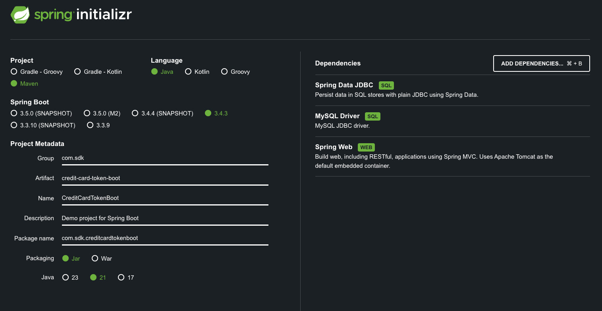

# Project Name

Credit Card Token Project

## Overview

Customers enter their credit card information which is then tokenized and saved to the database. Customers also chose a
payment processor that they would like to use. Customers will also want to move the credit card information from one
payment processor to another.

## Table of Contents

- [Prerequisites](#prerequisites)
- [Installation](#installation)
- [Dependencies](#Dependencies)
- [Testing](#testing)

### Prerequisites

- Java 21
- Spring Boot 3.4.3
- MySQL 9.2

### Installation

```bash
git clone https://github.com/sdanyalk/credit-card-token-boot.git
cd creditcard-token-project
```

### Dependencies

This project was created using Spring Initializr with the following settings


